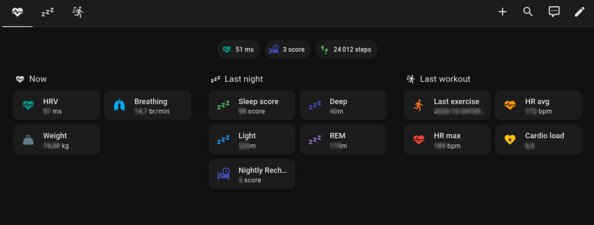

# Polar integration for Home Assistant

This a _custom component_ for [Home Assistant](https://www.home-assistant.io/).
The `polar` integration allows you to get information from [Polar](https://flow.polar.com).

You need to create a client in [Polar AccessLink](https://admin.polaraccesslink.com) with this `Authorization callback URL`:

* `https://my.home-assistant.io/redirect/oauth` (default)
* or `https://your_access_to_ha/auth/external/callback` if [My Home Assistant](https://www.home-assistant.io/integrations/my/) is disabled

## Installation

### HACS

HACS > Integrations > Explore & Add Repositories > Polar > Install this repository

### Manually

Copy the `custom_components/polar` folder into the config folder.

## Configuration

To add the Polar integration to your installation, go to Settings > Devices & services, click the button with + sign and from the list of integrations select Polar.

Enter the `Client ID` and `Client secret` of your Polar AccessLink client when asked for application credentials, then log in to Polar to link your account. The credentials can be managed later in Settings > Devices & services > ⋮ > Application credentials.

The interval between two updates from the Polar API (default: `30` minutes, minimum `5`) can be changed in the integration options.

When Polar rejects the access token (for instance after revoking the access in Polar Flow), a repair asks to re-authenticate the account.

### Upgrade from 1.x

Existing entries are migrated automatically: the client ID and secret are moved to the application credentials, and the access token is kept, so there is nothing to do. Only a new link of the account (new entry or re-authentication) requires the callback URL above in the Polar AccessLink client.

## Sensors

| Sensor | Description |
| --- | --- |
| `Weight` | Weight of the user |
| `Daily activity Calories` / `Duration` / `Steps` | Last daily activity summary, with its date as attribute |
| `Last exercise` | Start time (timestamp) of the last exercise, details as attributes |
| `Last exercise heart rate average` / `maximum` | Heart rate of the last exercise |
| `Last sleep score` | Sleep score of the last night, details as attributes |
| `Deep sleep` / `Light sleep` / `REM sleep` | Sleep stage durations of the last night |
| `Last nightly recharge` | Nightly Recharge status, details as attributes |
| `Heart rate variability` / `Breathing rate` | Averages measured during the last Nightly Recharge |
| `Cardio load` | Last computed cardio load, with strain, tolerance and status as attributes |

Cardio load and continuous heart rate depend on the device and on the consents given in Polar Flow: when they are not available, their data is simply missing.

## History

Polar keeps the last 28 days of data, but sensors only record history from the moment they are created. The integration imports this history as long-term statistics, available in the [Statistics graph card](https://www.home-assistant.io/dashboards/statistics-graph/) under the name of the user (statistic ids `polar:<user_id>_<metric>`):

* sleep score, deep/light/REM sleep, Nightly Recharge status, heart rate variability, breathing rate and cardio load: one value per day, updated after each scan;
* continuous heart rate: hourly average, minimum and maximum, updated every hour.

These statistics are separate from the sensors' own statistics, which only start when the sensor is created.

## Dashboard

[`dashboard/polar.yaml`](./dashboard/polar.yaml) is a ready-to-use dashboard with today's values, and the sleep and training history. It only uses built-in cards: create a new dashboard, open the raw configuration editor and paste it, after replacing the placeholders described at the top of the file.



## Development

```bash
pip install -r requirements_test.txt ruff
ruff check . && ruff format --check .
pytest
```

## Credits

Thanks to https://github.com/burnnat/ha-polar
